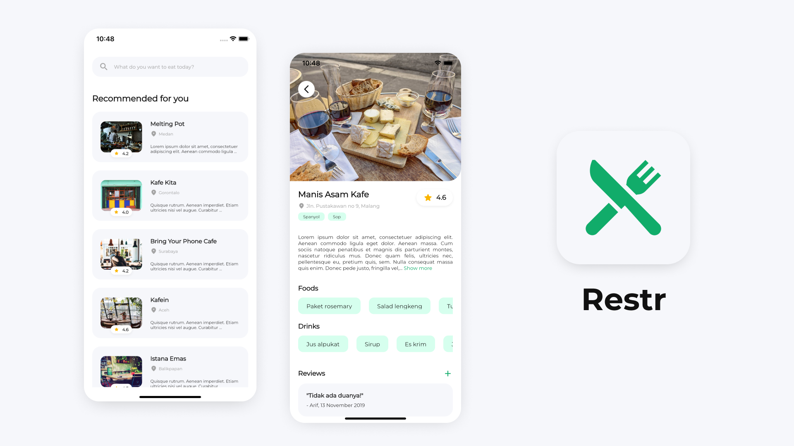
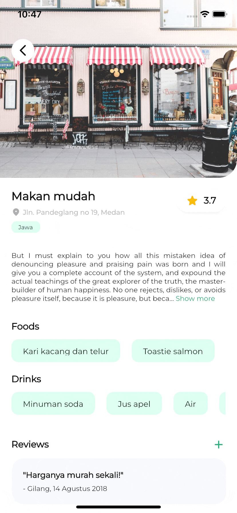

<h1 align="center">
  Restr Submission 2
</h1>
<p align="center">
  Restaurant App (Submission Flutter Fundamental Dicoding)
</p>
<p align="center">
  <a href="https://flutter.dev/"></a>
  <a href="https://dart.dev/"></a>
  <a href="https://github.com/Adithya-13/Restr/"></a>
</p>

<p align="center">
  
</p>

## Table of Contents
- [Introduction](#introduction)
- [Installation](#installation)
- [Demo](#demo)
- [Features](#features)
- [Tech Stack](#tech-stack)
- [Dependencies](#dependencies)

## Introduction

Restr is a Restaurant Application for the people who lookin for the Restaurant, Foods, Drinks, anything about that.

In this project, is to accomplish Submission Dicoding in Flutter Fundamental Course, and i use Riverpod for it. for details you can see [here](#tech-stack).

The challenge here is that I created a restaurant app with Riverpod Architecture, which is i never implement it before, so it was very challenging for me. To see what features I made, you can see [here](#features).

I, use Rivderpod as my State Management, Dependency Injection, and Service Locator.. To see what Dependencies I created, you can see [here](#dependencies).

for the submission 2, i add the API Service into this project using dio, and then i use NetworkExceptions to handle the exceptions.

## Installation

Clone or Download and Open it into Android Studio, VSCode, or Other IDE / Text Editor
```
https://github.com/Adithya-13/Restr.git
```  

## Demo

|Dashboard|Detail Restaurant|Search Restaurant|Add Review|
|--|--|--|--|
|||||

## Features
- Splash
- Dashboard
- Search
- Detail Restaurant
- Add Review

## Tech Stack
- [Riverpod Architecture](https://codewithandrea.com/articles/flutter-app-architecture-riverpod-introduction/)

## Dependencies
- [Cached Network Image](https://pub.dev/packages/cached_network_image)
- [Google Font](https://pub.dev/packages/google_font)
- [Go Router](https://pub.dev/packages/go_router)
- [Flutter Riverpod](https://pub.dev/packages/flutter_riverpod)
- [Lottie](https://pub.dev/packages/lottie)
- [Readmore](https://pub.dev/packages/readmore)
- [Freezed](https://pub.dev/packages/freezed)
- [Dio](https://pub.dev/packages/dio)
- [RxDart](https://pub.dev/packages/rxdart)
- [Modal Bottom Sheet](https://pub.dev/packages/modal_bottom_sheet)


